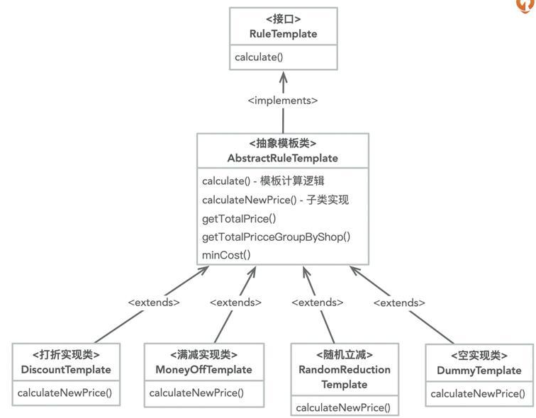

## 从coupon-template-api和coupon-calculation-api两个依赖项中，你可以拿到订单优惠计算过程用到的POJO对象
coupon-calculation-serv需要计算订单的优惠价格，那就得知道当前订单用了什么优惠券。
封装了优惠券信息的Java类CouponInfo位于coupon-template-api包下，因此我们需要把coupon-template-api的依赖项加入到coupon-calculation-api中。

## 运用了模板设计模式来封装计算逻辑
  
各个具体的优惠计算类通过继承AbstractRuleTemplate，并实现calculateNewPrice来编写自己的优惠计算方式。  
## service层实现逻辑
通过CouponTemplateFactory工厂类获取到具体的计算规则，然后调用calculate计算订单价格就好了  