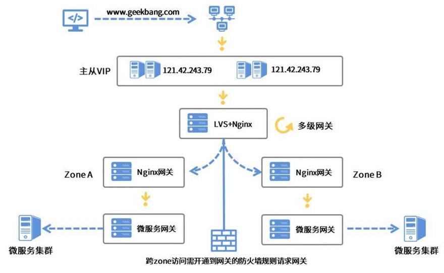
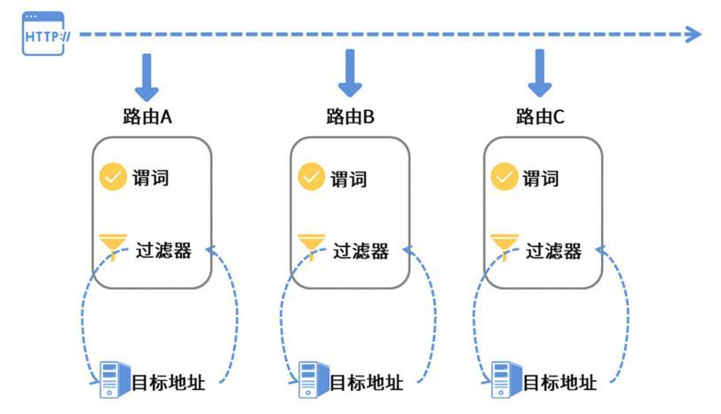
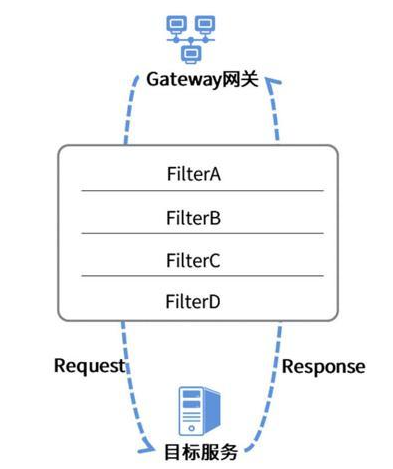
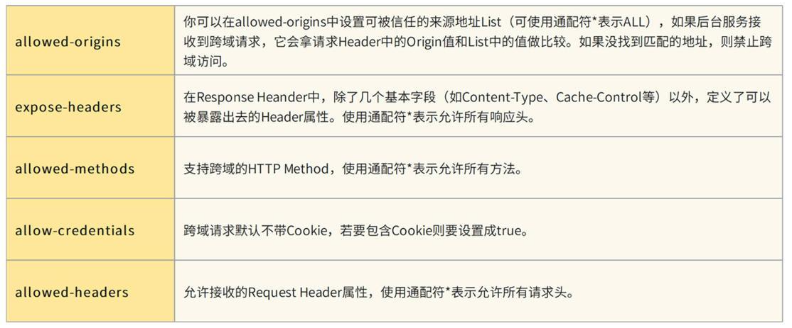

# 七、集成网关 Gateway
> 不要把gateway作为直接对外的网关层，只用于内部服务治理，对外还是交给nginx这类高性能网关做。

gateway本身也是一个注册在nacos上的微服务，这就意味着它可以获取到nacos中所有服务的注册表，这样就可以根据本地的路由规则，将请求精准无误地送达到每个微服务组件中。
## 路由规则

### 路由
gateway的基本单元，每个路由都有一个目标地址，这个地址就是当前路由规则要调用的目标服务
### 谓词
实际是路由判断规则，比如，可以为某个路由设置一条谓词规则，约定访问路径的匹配规则为Path=/bingo/*，这种情况下只有以/bingo/开头的路径才会被当前路由选中。
当某个请求匹配到多个路由，有优先级设置。
### 过滤器
gateway把请求转发给目标服务的过程中，把这个任务全权委托给了过滤器（Filter）来处理。

## 集成gateway

### 跨域配置
定义在的spring.cloud.gateway.globalcors.cors-configurations节点

### 定义路由规则
RoutesConfiguration
## Redis + Lua实现限流方案
RedisLimitationConfig